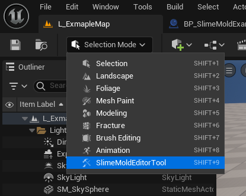

# SlimeMoldTool, but technically a skeleton editing tool

> The tool is still work-in-progress\
> Some groundbreaking changes might appear

https://github.com/user-attachments/assets/d67b30e3-7c07-48e2-91a8-1b47c4b09978

This project implements a new editor mode with 2 tools:
- **Skeleton Editor** - allows the user to place points and connect them with lines
- **Mesh Editor** - can generate mesh in the editor from the points and lines

> *Reminder, that's how I used the tool in our team's project.*
> *But as a developer, you can use it for your own purposes in any way you want.*

# Usage

## How to install to your project

That's easy!\
Copy the `SlimeMold` folder from the `/Plugins` folder of this repository, and paste it into your project's `/Plugins` folder.\
Then, when your project launches with that plugin for the first time, it will ask you to build two modules (`SlimeMold` and `SlimeMoldEditorTool`). Press build and wait a little.\
After that, the tool is ready to use.

> You might need Visual Studio installed to be able to build the plugin.

## How to actually use the tool

1. Get an actor and add the `SlimeMoldActorComponent` component to it. The tool can edit only those actors that have this component attached by default.
   
2. In the top right switch the editor mode to `SlimeMoldEditorTool`
   
3. Select the actor with the component
4. Select any tool you want to use, further explanation regarding the tools can be found in [the tools section](#Tools)

# Tools

## Skeleton Editor

`/Plugins/SlimeMold/Source/SlimeMoldEditorTool/Tools/SkeletonEditing/`

In the skeleton editor you can place / move / delete points and connect / disconnect them with lines.

### Mouse and keyboard controls:

**Mouse click:**\ 
If any point has been clicked, selects only this point (deselects all the rest) \
If empty space has been clicked, deselects the selection

**Ctrl + Mouse (click or hold):**\
Additionally selects another points (does not deselects the rest)\
A user can hold and move the mouse around to select multiple points 

**Shift + Mouse click:**\
If mouse is over a point, connects all the selected points with the one mouse is over\
If mouse is not over any point, creates a new point and connects all the selected points with it

> Controls do not work if the mouse is over the void / skybox. Mouse must point to visible meshes placed in the level.

### Gizmo:

If you select the points, gizmo appears and you can move the points around using this gizmo

### Panel:

- **Buttons:**
  - **Delete:**\
    Deletes selected points

  - **Disconnect:**\
    Disconnects selected points

  - **Split line:**\
    Creates new points in the middle of the selected lines and updates the lines (connections)

- **Point data:**\
  Here are extra variables that are stored in the points. The data is unique per point.\
  If you select multiple points and edit the parameters, all the selected points will update with new values.

- **Editor settings:**
  - **Selection radius threshold:**\
    Threshold of mouse screen-distance to the point to select it. The lower is the value, the smaller distance to the point is needed to select it.
  - **Change selection on Point create:**\
    If checked, when new point is created, it automatically becomes selected and all the other points are deselected.\
    If unchecked, the newly created point is not selected and all the other points remain selected
  - **Editor colors:**\
    Gives the user the ability to change the colors of skeleton visualisation in the editor

## Mesh Editor

### Panel:

- **Buttons:**\
  All the buttons are predefined events (delegates) in the component. In other words, when you press the button, the accompanying event is called in the actor you are editing.

  - Generate mesh
  - Generate debug info
  - Clear mesh
  - Assign materials

- **Mesh Property Class:**\
  Properties that are passed to the actor when the buttons are pressed.\
  You have to select a specific class in the drop-down menu.\
  You can create your own class, so that creating your own properties that will be available in the panel for editing.\
  Check [customization](#customization) section for more info.

# Customization

## Custom Mesh editor property set

### Create custom properties

The tool allows (forces) you to create your own mesh editor properties.\
To do so:

0. Open content browser
1. Create a new class that inherits from the `SlimeMoldMeshPropertyBase` class\
   
2. Create a variable and make it public by click an "eye" icon next the the variable\
   
3. Go to the editor
4. Select any actor with attached `SlimeMoldActorComponent`
5. Select the `Mesh Editor` in the tool
6. In the 'Mesh Property Class' drop-down menu, select your class.\
   

Now you can see and edit your variables in the panel.\

### Use custom properties

To use them in the actor's code you will have to cast the property object (that comes with events) to your class.\
To do so:

1. Open blueprint class of your actor
2. In the components window, select the `SlimeMoldActorComponent` component\
   
3. In the details panel, find 'Events' section and create (or locate in the editor graph) any of the events - `OnGenerateMesh`; `OnGenerateDebugInfo`; `OnClearMesh`; `OnAssignMaterials`\
   
4. Now you should see an event in the blueprint graph, this event will be called when the associated button is pressed. This event has varaible with it.\
   
5. Cast the variable to your class\
   

Now you can use your variables from the tool's panel in the actor's code.

# Extra info

## SlimeMoldActorComponent

This component is storage of the skeleton data and has 4 events (delegates) mentioned in the Mesh Editor panel. These events are called when the according buttons are pressed in the Mesh Editor panel.

# Example

In this repository there is an example project that uses the tool. The way I intended it to use is: using skeleton toll to create a skeleton (a frame); using mesh tool to generate mesh from the skeleton.

## Content

- **L_ExampleMap** - map that contains the an exmaple actor
- **BP_SlimeMoldExample** - blueprint class with `SlimeMoldActorComponent` component and some generation code
- **PS_SlimeMoldMeshPropertiesExample** - custom mesh editor property set
- **M_GoopMaterialExample** - material for generated mesh